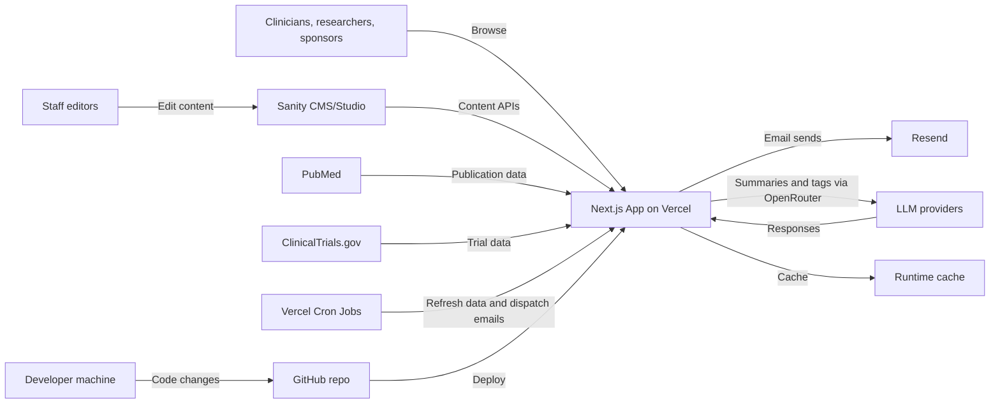

# KCRU Research Unit Website

A clinical research unit website is a web application developed by researchers in Nephrology to stay current with minimal manual effort. It keeps publications, trials, and metrics up to date. The public-facing experience is designed for healthcare providers, researchers, sponsors, and trainees who need accurate, current information. Automated data refreshes and admin workflows reduce the maintenance burden that typically makes research sites go stale.

## What this site does

- Publishes recruiting study listings with referral workflows and coordinator routing.
- Showcases the team, training opportunities, alumni, and research network sites.
- Presents sponsor and physician referral information with structured capabilities.
- Aggregates publications and citation metrics from authoritative sources.
- Sends study updates and publication newsletters on a reliable schedule.
- Provides admin tools and LLM/SEO summaries for operational visibility.

## Automation-first by design

Research websites go out of date quickly. This project solves that by automating the highest-friction content and keeping it current without manual curation.

- Publications are pulled from PubMed using investigator queries, deduplicated across the group, and refreshed on a schedule.
- Publications can include AI-generated lay summaries and tags for topic, study type, and methods/approaches.
- Those tags roll up into a live summary of what the unit works on and how it does it, updating automatically as new papers appear.
- Adding a registered study can be as simple as entering the NCT ID, local PI name, and coordinator email.
- Study details and eligibility are pulled from ClinicalTrials.gov, with plain-language summaries generated for clarity.

## Who it serves

- Referring physicians and community clinics.
- Researchers and collaborators looking for current outputs.
- Sponsors, CROs, and funders evaluating capabilities.
- Trainees exploring opportunities and alumni outcomes.

## Highlights

- Sanity-first content model so staff can edit most pages without code.
- Automated research data ingestion (PubMed, ClinicalTrials.gov) with caching.
- Optional LLM summaries and classification for publications, cached for stability.
- Maintenance mode that can be toggled in Sanity without developer help.
- Clear separation of public pages, admin tools, and API routes.
- Built for long-term maintainability with stable Next.js patterns.

## How it works

- Next.js App Router powers public pages, admin UI, and API routes.
- Sanity CMS stores structured content and site settings.
- Scheduled cron jobs refresh external data and dispatch emails.
- Cached results are stored in `runtime/` to keep the site fast and resilient.
- Email delivery is handled via `lib/email.js` (Resend).

## Architecture



## Content and staff workflows

- **Studies:** Recruiting-focused listings (plus coming soon and not recruiting), eligibility emphasis, and referral routing.
- **Referrals:** Collects only the referring provider's email and routes to the study coordinator; no patient-identifying information is collected.
- **Updates and newsletters:** Subscriptions enable two outreach methods. Publication newsletters summarize new papers with key takeaways and links. Study updates highlight actively recruiting studies and provide a one-click referral pathway for clinicians. Together they keep internal teams, referring providers, and external collaborators aware of current research and make engagement easy.
- **Team:** Researcher profiles and publication ties.
- **News and training:** Posts, opportunities, and alumni.
- **Contact:** Form submissions routed by Sanity-managed rules.
- **Site settings:** Global config, maintenance mode, newsletter settings.

## Data pipelines

- **PubMed:** Publication metadata and abstracts, cached daily.
- **ClinicalTrials.gov:** Trial metadata and eligibility to support study listings.
- **LLM summaries:** Plain-language publication summaries generated once and cached.

## Admin and maintenance

- Admin hub at `/admin` with scoped access for approvals and updates.
- Legacy admin URLs remain supported for continuity.
- Maintenance flow uses `/under-construction`, `/api/maintenance`, and `/api/auth`.
- Allowlisted paths still resolve during maintenance (`/llms.txt`, `/sitemap.xml`, `/robots.txt`, and markdown endpoints).

## LLM and markdown endpoints

- `/llms.txt` provides a site summary for AI tools.
- `/markdown/*` and `*.md` expose page-level markdown summaries.
- `/api/seo/refresh` updates SEO metadata and LLM summaries.

## Tech stack

- **Framework:** Next.js (App Router)
- **CMS:** Sanity
- **Styling:** Tailwind CSS
- **Email:** Resend
- **Hosting:** Vercel

## Local development

```bash
npm install
npm run dev
```

Environment variables (example):

```
NEXT_PUBLIC_SANITY_PROJECT_ID=your_project_id
NEXT_PUBLIC_SANITY_DATASET=production
SANITY_API_TOKEN=your_token
RESEND_API_KEY=re_xxx
PUBMED_API_KEY=your_ncbi_key
```

## Cron jobs

Cron schedules are defined in `vercel.json`, including:

- `/api/pubmed/refresh` - refreshes the PubMed cache
- `/api/updates/study-email/dispatch` - sends scheduled study updates

Optional SEO refresh can piggyback on the PubMed cron with `SEO_REFRESH_ON_PUBMED_CRON=true`.

## Key paths

- `app/` pages, layouts, and API routes
- `app/admin/` admin hub and entry points
- `app/components/` shared UI components
- `app/llms.txt/` LLM summary endpoint
- `app/markdown/` markdown endpoints
- `lib/` data clients, caching, helpers
- `sanity/` Sanity Studio config and schemas
- `scripts/` maintenance scripts
- `runtime/` generated caches and locks (do not edit by hand)

## Contributing

This project favors stable patterns and maintainability. Keep editable content in Sanity whenever possible, and avoid hard-coded copy that staff cannot update.
