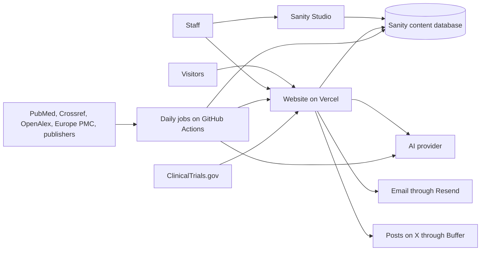

# London Kidney Clinical Research website

This repository holds the code for [londonkidney.ca](https://londonkidney.ca), the website of the Kidney Clinical Research Unit (KCRU) in London, Ontario. If you followed the "Technical information about this site" link at the bottom of the website, this page explains what the site does, where its information comes from, how it uses artificial intelligence (AI), and what it keeps when you fill in a form. The final sections are for the staff and developers who maintain it.

Research unit websites tend to fall out of date because each new paper, study, and team change has to be added by hand. This site does much of that work itself. Every morning it searches for new papers by the unit's investigators, writes a short summary of each one in plain language, and updates the publication pages. Study coordinators add and update studies through a web form, and administrators approve the changes before they appear. Staff edit everything else, such as profiles, page text, and settings, in a content editor without touching code.

## Contents

- [What visitors can do](#what-visitors-can-do)
- [Publications](#publications)
- [Studies and referrals](#studies-and-referrals)
- [Trial assistant](#trial-assistant)
- [Email updates](#email-updates)
- [Posts on X](#posts-on-x)
- [What runs automatically](#what-runs-automatically)
- [How the site uses AI](#how-the-site-uses-ai)
- [Information the site keeps](#information-the-site-keeps)
- [For staff](#for-staff)
- [How the site is built](#how-the-site-is-built)
- [For developers](#for-developers)

## What visitors can do

| Page | What it offers |
| --- | --- |
| Home | The unit's aims, a featured recruiting study, counts of active studies and of publications since 2022, the clinical investigators and their institutions, and a scrolling list of recent papers. Buttons lead to the studies and to the contact form for donations and industry partnerships. |
| Studies | All listed studies, grouped as currently recruiting, coming soon, active but not recruiting, and completed. Visitors can search or filter by therapeutic area. Each study page describes the study and who can take part. Pages for recruiting studies also link to ClinicalTrials.gov and, when the study accepts referrals, include a referral form. |
| Team | Profiles of clinical investigators, PhD scientists, and research staff, each with a biography, the person's studies, and their publications. |
| Publications | All papers since 2022, grouped by year. Each paper has a summary in plain language, topic tags, an Altmetric badge that tracks online attention such as news and social media coverage, and buttons to share it on X or LinkedIn. |
| Subscribe | Sign-up for email updates about studies and new publications. |
| Contact | A form that sends each message to the right person, based on the reason the visitor picks. People asking about training can attach a CV. |

The footer links to the privacy and accessibility statements and to this page. Three more pages are not in the menu but can be reached by direct link or through search engines: news (`/news`), open trainee positions (`/training`), and the unit's research capabilities for industry sponsors (`/capabilities`).

A "Find studies for your patients" button in the bottom-right corner of public pages opens the [trial assistant](#trial-assistant).

## Publications

### Finding papers

Every morning the site searches four sources for papers by the unit's investigators:

- PubMed, using a search written for each investigator.
- Crossref, by the investigator's name and ORCID iD.
- OpenAlex and Europe PMC, for investigators who have an ORCID iD.

It lists papers published since 2022. Preprints found through Crossref, OpenAlex, or Europe PMC are left out. A paper found in more than one source is listed once, matched by its DOI or, when it has none, its PubMed ID.

### Checking authorship

Author names are ambiguous, and a search for a common surname and initial can return papers by several different people. The site accepts a match on its own only when the evidence agrees. Examples are a matching author name in PubMed on a paper from the investigator's own PubMed search, a matching ORCID iD and name, or the full name appearing alongside coauthors who recur on the investigator's confirmed papers. The site discards clear conflicts, such as a different middle initial. Every other match is held back until an administrator approves or rejects it at `/admin/publications`.

When matches are waiting, administrators receive one email after the morning search, and a reminder for any match still waiting after 7 days. Approved papers appear after the next morning search. A rejected paper goes on that investigator's exclusion list, so it does not return.

### What is left out

The site leaves out corrections, comments on other papers (such as letters to the editor about an article and the authors' replies), and supplementary files that journals register as separate records. Research letters that report new findings are kept. Staff can also remove a specific paper from a specific investigator's list.

### Summaries and tags

For each new paper, an AI model reads the abstract or other available text, writes a summary of 2 to 3 sentences in plain language, and assigns tags in three groups:

- Research areas (22 tags, such as hemodialysis, kidney transplantation, and acute kidney injury).
- Study types (8 tags, such as observational study and qualitative study).
- Methods and approaches (15 tags, such as pragmatic trial, administrative data, and machine learning).

Each summary and its tags are written once and kept, not regenerated every day. The Research Profile panel at the top of the publications page counts these tags to show what share of the unit's papers falls under each one. Selecting a tag filters the list.

### Papers without an abstract

Some papers, such as editorials, have no abstract in PubMed. For these, the site looks for text on the publisher's website, in Crossref, OpenAlex, and Europe PMC, and finally in the main text of the article. When the only thing available is an image of the article's first page, which is common for editorials behind a paywall, an AI model reads the text from the image. If nothing works, a paper found in PubMed is listed without a summary and the site tries again 7 days later. A paper found only in the other sources is not listed until some text turns up.

### Keeping the list stable

A paper that drops out of one day's search results stays on the site. It is removed only after it has been missing from 3 searches in a row, and a day counts only if the searches for its authors ran without errors. An outage at PubMed or another source therefore cannot empty the publications page.

### Publications feed

The RSS feed at `/publications/feed.xml` lists papers from the last 60 days that have a summary, up to 50, newest first. Feed readers and social media tools can follow it.

## Studies and referrals

### Adding and updating studies

Study coordinators sign in to the Study Manager at `/trials/manage` with their LHSC or St. Joseph's Microsoft account. For a study registered on ClinicalTrials.gov, the coordinator enters its NCT number and selects "Fetch from ClinicalTrials.gov". The site copies the title, eligibility criteria, phase, and other details from ClinicalTrials.gov. An AI model then drafts three short texts: a summary of 3 to 5 sentences written for physicians, a short title, and a brief eligibility statement for the study update emails. The coordinator can edit all three, and adds the local principal investigator, the local contact, the therapeutic areas, the recruitment status, and whether the study accepts referrals. Studies that are not registered can be entered by hand.

A coordinator's new study or change goes to administrators for approval. They review it at `/admin/approvals` and either publish it or return it to the coordinator as a draft, with an email. Administrators can also edit studies directly at `/admin/studies` or in Sanity Studio.

The site does not check ClinicalTrials.gov on a schedule. Details change only when someone fetches them again, and staff set the recruitment status themselves. Changes reach the studies list within 30 minutes. A study's own page can take up to 12 hours.

### Referrals

On a recruiting study that accepts referrals, a healthcare provider enters their email address, confirms that they are a healthcare provider, and sends the form. The site emails the study's local contact, who replies to the provider directly. The form asks for no information about the patient.

The study update emails offer a second route. Each study in those emails has a "Refer a patient" button that opens a message already addressed to the study contact in the reader's own email program. For readers with an LHSC or St. Joseph's email address, the message includes a line for the patient's medical record number. The website never sees these messages.

## Trial assistant

The trial assistant helps clinicians find studies that might suit a patient. It opens from the "Find studies for your patients" button in the bottom-right corner of public pages. The clinician describes the patient in general terms, such as the kidney diagnosis, eGFR, dialysis or transplant status, and urine protein results. The assistant asks a few follow-up questions and then lists up to 6 recruiting studies. For each study, it explains why the study may fit, what still needs checking, and why it may not fit. The study team confirms eligibility, so the list is a starting point for a referral rather than a decision.

An AI model conducts the conversation, and a second AI request ranks the studies. The model sees only the public information about each recruiting study: the title, summary, and inclusion criteria. If the ranking request fails, the site ranks the studies with a simpler method based on fixed rules. Where the browser supports it, the clinician can dictate instead of typing. Dictation uses the browser's own speech recognition, and some browsers, such as Chrome, send the audio to the browser maker to convert it to text.

What happens to what you type:

- The site does not save the conversation or email it to anyone. It exists only in the open browser tab and disappears when the page reloads or you select Reset.
- To write its replies, the site sends the conversation to an outside AI service.
- The site does not try to strip identifying details from messages, because every automatic method tested removed clinical details, such as diagnoses, far more often than it removed identifiers. Instead, the chat window asks for details that do not identify the patient (no names, birth dates, phone numbers, or record numbers), and the assistant is instructed never to ask for them.
- To limit misuse, each network address can send up to 20 messages every 15 minutes, and the site accepts up to 500 messages an hour in total. The site stores only a one-way hash of the address for this purpose.

## Email updates

Anyone can subscribe at `/updates`. The form asks for an email address and a role, such as physician, nurse, research staff, or patient or caregiver. Name, specialty, and location of practice are optional. A welcome email includes a private link for changing choices or unsubscribing, and every later email carries the same link.

Subscribers choose from two kinds of email. The numbers and days below are defaults that staff can change in Site Settings.

**Research and publication news.** Each issue lists up to 8 of the unit's papers published since the previous issue, with the title, journal, the unit's investigators, and the plain language summary. It goes out on the third Monday of the month, but only when more than 30 days have passed since the previous issue and there is at least one new paper. In practice it arrives every one to two months.

**Updates about active studies.** Clinicians and research staff can also choose this option and pick the patient populations they care about. On the first Monday of each month, each subscriber receives up to 4 recruiting studies that accept referrals and match their choices. Each study appears with a short title, a brief statement of who is eligible, the principal investigator, a link to the study page, and the "Refer a patient" button described above.

Administrators can also send a one-off plain text message from `/admin/updates` to all newsletter subscribers or to a subset chosen by role, specialty, or patient population.

## Posts on X

The unit posts about selected new papers on X. When the morning search finds new papers, the approvers named in Site Settings receive one email listing the papers they could post about. An approver opens `/admin/social`, picks a paper, and asks the AI model for a draft. The draft names each of the unit's investigators on the paper, avoids "we" and "our", leaves out the journal name, and fits X's 280-character limit. It ends with a link to the paper's entry on one investigator's profile page on this site, or to the paper itself when none of its investigators has a profile.

The approver edits the text and queues it in Buffer, a scheduling service that publishes it on X at the next open time slot. Nothing is posted without an approver's action, and a queued post can be withdrawn until Buffer publishes it.

## What runs automatically

Scheduled jobs run on GitHub Actions, a service that runs tasks for this repository on a timetable. People with access to the repository can also start any job by hand from its Actions tab.

| Time (UTC) | Eastern time | What happens |
| --- | --- | --- |
| 09:00 every day | 5 a.m. (4 a.m. in winter) | Search for new papers, check authorship, look for missing abstracts, write summaries and tags, and save the results. Then refresh the public pages, email administrators about matches to review, update the page descriptions that search engines and AI tools read, and email approvers about papers they could post on X. |
| 11:00 every day | 7 a.m. (6 a.m. in winter) | Check whether today is the day for the study update email or the research news email, and send it if so. |

Nothing checks ClinicalTrials.gov on a schedule.

## How the site uses AI

| Task | When it runs | Who reviews the result |
| --- | --- | --- |
| Summary and tags for each paper, including reading the first page of papers that exist only as an image | Once per paper, during the morning search | Nobody before it appears |
| Summary, short title, and eligibility statement for each study | When a coordinator fetches a study or asks for a new draft | The coordinator, then an administrator |
| Trial assistant conversation and study ranking | With each message | The study team, when it assesses a referral |
| Drafts of posts on X | When an approver asks for one | The approver, who edits and queues the post |
| Page descriptions for search engines, and the summary of the unit at `/llms.txt` | During the morning job | Nobody before it appears |

Staff choose the AI provider and model in Site Settings, and the trial assistant can use a different model from the other tasks. The site supports OpenRouter (the default), OpenAI, Anthropic, Groq, Together AI, and Ollama, which runs models on a local server. Keys for these services are kept in the server configuration, never in the content editor.

## Information the site keeps

The site stores these records in its content database (Sanity):

- **Subscriptions:** the details the subscriber entered and their choices, with the time of sign-up, the IP address, the browser type, and the score from the spam check.
- **Contact form messages:** name, email address, reason, and message, with the IP address and browser type. An attached CV is emailed to staff but not stored.
- **Referrals from study pages:** the provider's email address, the study, and the time, with the IP address and browser type.
- **Trial assistant:** no conversation or patient details. It keeps only the hashed network addresses used for the message limits.

The site counts visits and measures page speed with Vercel Web Analytics and Speed Insights. Public forms use Google reCAPTCHA to block automated submissions. The [privacy statement](https://londonkidney.ca/privacy) has more detail.

## For staff

### Editing content

Staff edit content in Sanity Studio, a separate editing app hosted by Sanity. It holds researcher profiles, studies, therapeutic areas, news posts, trainee opportunities, research sites, the capabilities page, page headings and introductions, the contact form reasons and where each one goes, and Site Settings. Its PubMed Cache tab shows when the morning search last ran and how many papers and summaries are stored, and it can search the stored papers.

Most pages show a change within an hour. The home page updates within 10 minutes, and a study's own page within 12 hours.

Site Settings holds:

- the lists of study coordinators, approval administrators, and update administrators, and the email domains allowed to sign in;
- switches for the trial assistant, posts on X, the publication review step, Altmetric badges, and maintenance mode;
- email schedules, wording, and test mode, which sends email only to listed test addresses;
- the AI provider and model, and the instructions given to the AI for several tasks.

### Staff tools

Staff sign in at `/login` with their LHSC or St. Joseph's Microsoft account. Only people named in Site Settings can sign in, and each person sees only the tools for their role. `/admin` links to the administrator tools.

| Address | Who uses it | What it does |
| --- | --- | --- |
| `/trials/manage` | Study coordinators | Add and update studies. Changes go to administrators for approval. |
| `/admin/approvals` | Approval administrators | Review, edit, publish, or return study submissions. |
| `/admin/studies` | Approval administrators | Add and edit studies directly. |
| `/admin/publications` | Approval administrators | Approve or reject uncertain matches between papers and investigators. |
| `/admin/social` | Approval administrators | Draft, edit, queue, and withdraw posts on X, and edit the instructions the AI follows when drafting. |
| `/admin/classification-eval` | Approval administrators | Test Jev, an alternative model for tagging papers, against the current tags, adjust its thresholds, and choose which model tags new papers. |
| `/admin/updates` | Update administrators | Manage subscribers, send study update and newsletter emails, send one-off messages, and turn test mode on or off. |

The older addresses `/trials/approvals` and `/updates/admin` still work.

### Maintenance mode

Turning on Enable Maintenance Mode in Site Settings sends visitors to an "under construction" page with a message that staff write. Staff who enter the access password set there can browse the site normally in that browser for 7 days. The sitemap, robots.txt, llms.txt, the Markdown pages, and the RSS feed stay available.

## How the site is built

The website runs on Vercel, and its content and stored records live in Sanity. Staff edit content in Sanity Studio. The daily jobs on GitHub Actions gather papers from PubMed and the other sources, have the AI provider write summaries and tags, save the results straight to Sanity, and then ask the website to send emails and refresh pages. The website fetches study details from ClinicalTrials.gov when a coordinator asks for them, and uses outside services for AI, email, and posts on X.


```mermaid
flowchart LR
  Visitors[Visitors] --> Site[Website on Vercel]
  Staff[Staff] --> Site
  Staff --> Studio[Sanity Studio]
  Studio --> Sanity[(Sanity content database)]
  Site --> Sanity
  Sources[PubMed, Crossref, OpenAlex, Europe PMC, publishers] --> Jobs[Daily jobs on GitHub Actions]
  Jobs --> Sanity
  Jobs --> Site
  CTgov[ClinicalTrials.gov] --> Site
  Site --> AI[AI provider]
  Jobs --> AI
  Site --> Resend[Email through Resend]
  Site --> Buffer[Posts on X through Buffer]
```

| Part | Service |
| --- | --- |
| Website | Next.js (React) on Vercel, with Vercel Web Analytics and Speed Insights |
| Content editor and database | Sanity |
| Page design | Tailwind CSS |
| Email | Resend |
| Staff sign-in | Microsoft Entra ID (Azure AD) through NextAuth |
| Scheduled jobs | GitHub Actions |
| AI | Configurable in Site Settings; OpenRouter by default |
| Posts on X | Buffer |
| Publication data | PubMed, Crossref, OpenAlex, Europe PMC, and publisher websites |
| Study data | ClinicalTrials.gov |
| Attention badges | Altmetric |
| Spam protection | Google reCAPTCHA |

Search engines and AI tools can also read:

- `/sitemap.xml` and `/robots.txt`.
- `/llms.txt`, a plain text summary of the unit for AI tools.
- Markdown versions of the main pages, at the page address plus `.md` (for example, `/publications.md`; the home page is `/index.md`).
- `/publications/feed.xml`, the RSS feed described above.

## For developers

### Run the site locally

You need Node.js 22 (the version the scheduled jobs use) and access to the Sanity project.

```bash
npm install
npm run dev      # website at http://localhost:3000
npm run studio   # Sanity Studio at http://localhost:3333
```

Put settings in `.env.local`, which git ignores. The public pages need only the two variables in the first row below. Each other feature needs its own.

| Variables | Needed for |
| --- | --- |
| `NEXT_PUBLIC_SANITY_PROJECT_ID`, `NEXT_PUBLIC_SANITY_DATASET` | Everything. The site will not start without them. |
| `SANITY_STUDIO_PROJECT_ID`, `SANITY_STUDIO_DATASET` | Running Sanity Studio |
| `SANITY_API_TOKEN` | Saving anything: forms, subscriptions, staff tools, and the publication search |
| `NEXTAUTH_URL`, `NEXTAUTH_SECRET`, `AZURE_AD_CLIENT_ID`, `AZURE_AD_CLIENT_SECRET`, `AZURE_AD_TENANT_ID` | Staff sign-in |
| `RESEND_API_KEY`, `CONTACT_FROM_EMAIL`, `CONTACT_FROM_NAME` | Sending email |
| `SITE_URL` | Full links in emails, the sitemap, the RSS feed, and posts on X |
| `OPENROUTER_API_KEY`, or the key for another provider (`OPENAI_API_KEY`, `ANTHROPIC_API_KEY`, `GROQ_API_KEY`, `TOGETHER_API_KEY`) | AI features |
| `NEXT_PUBLIC_RECAPTCHA_SITE_KEY`, `RECAPTCHA_SECRET_KEY` | Spam protection on forms (optional) |
| `PUBMED_API_KEY`, `CROSSREF_MAILTO`, `OPENALEX_API_KEY` | Higher rate limits for the publication search (optional) |
| `BUFFER_API_KEY` | Queuing posts on X |
| `CRON_SECRET` | Authenticating the scheduled jobs |
| `PUBMED_REFRESH_TOKEN`, `SEO_REFRESH_TOKEN`, `STUDY_UPDATE_SEND_TOKEN`, `PUBLICATION_NEWSLETTER_SEND_TOKEN` | Starting jobs by hand |

Other optional variables adjust individual features. Searching the code for `process.env` lists them all.

### Common commands

| Command | What it does |
| --- | --- |
| `npm run dev` | Start the website locally |
| `npm run build` | Build the website for production |
| `npm run lint` | Check the code with ESLint |
| `npm test` | Run the unit tests in `tests/` with Node's built-in test runner |
| `npm run studio` | Start Sanity Studio locally |
| `npm run refresh:pubmed` | Run the morning publication search |
| `npm run reclassify:pubmed` | Re-tag stored papers without searching again |

No workflow runs the tests or lint on pull requests, so run `npm run lint` and `npm test` before pushing. `AGENTS.md` lists the other maintenance scripts.

### Scheduled jobs

| Workflow | Runs (UTC) | Steps |
| --- | --- | --- |
| `pubmed-refresh.yml` | 09:00 daily | Runs `npm run refresh:pubmed`, then calls `/api/pubmed/revalidate`, `/api/publications/attribution-review/dispatch`, `/api/seo/refresh`, and `/api/social/dispatch` |
| `study-email.yml` | 11:00 daily | Calls `/api/updates/study-email/dispatch`, which sends only on the scheduled weekday |
| `publication-newsletter.yml` | 11:00 daily | Calls `/api/updates/publication-newsletter/dispatch`, which sends only on the scheduled weekday |

The workflows live in `.github/workflows/` and read these repository secrets: `SITE_URL`, `CRON_SECRET`, `NEXT_PUBLIC_SANITY_PROJECT_ID`, `NEXT_PUBLIC_SANITY_DATASET`, `SANITY_API_TOKEN`, the AI provider key, and optionally `PUBMED_API_KEY`, `CROSSREF_MAILTO`, and `OPENALEX_API_KEY`. Manual runs of the two email jobs use `STUDY_UPDATE_SEND_TOKEN` and `PUBLICATION_NEWSLETTER_SEND_TOKEN`. Scheduled runs refresh the SEO descriptions unless the repository variable `SEO_REFRESH_ON_PUBMED_CRON` is set to a value other than `true`. `vercel.json` defines no scheduled jobs.

### Repository layout

| Path | Contents |
| --- | --- |
| `app/` | Pages, staff tools, and API routes (`app/api/**/route.js`) |
| `app/components/` | Shared page components, including the trial assistant |
| `lib/` | Data sources, AI requests, email, and shared logic |
| `sanity/` | Sanity Studio configuration and content types |
| `scripts/` | Maintenance and data scripts |
| `tests/` | Unit tests |
| `docs/` | Design notes for individual features |
| `.github/workflows/` | Scheduled jobs |
| `proxy.js` | Maintenance mode redirect |

### Further reading

- `AGENTS.md` is the detailed technical reference and list of conventions, for people and coding agents working on the code.
- `docs/` holds design notes for individual features.
- `PROJECT_SPECIFICATION.md` is the original design brief. The site has changed a great deal since it was written, so treat it as history.

### Conventions

- Keep anything staff might want to change in Sanity rather than in code.
- Prefer standard Next.js and Sanity patterns over custom ones.
- `next` is pinned to an exact version. Upgrade it deliberately, test the build, and read the notes in `AGENTS.md` first.
- Update `AGENTS.md` when you change how a feature works.
